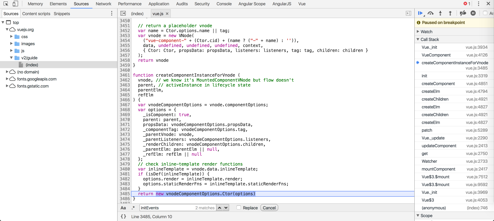

> 基本思路:
1. 首先通过模块依赖关系找到Vue类在哪定义
2. Vue类的属性及方法在哪个阶段定义的，理清添加的顺序及依赖关系
3. Vue实例化初始化方法的执行顺序，找到生命周期钩子在哪些对应方法中触发的
4. Vue实例化时，组件模板是如何渲染并更新到`el`上的
5. Vue实例，vm的Data响应式是怎么实现的
6. 阅读源码全程忽略`process.env.NODE_ENV !== 'production'`条件里的代码，先了解主流程

### 要理清命名的规则，便于理解每一步的作用
- xxxMixin(Vue) -- 给Vue类添加原型方法
- initXxx(vm) -- 给vm添加初始化属性
- vm -- 对应Vue的实例
- 内置私有方法或属性前加下划线`_`, 暴露给外部调用的方法或属性前加美元符号`$`

我们可以查看组件的接口配置文件`flow/component.js`，基本上包含了一个组件的所有属性和方法。

## 从代码构建入手

### 1. package.json
从scripts属性可看到打包入口文件build/build.js
```js
{
	...
	"build": "node build/build.js"
	...
}
```

可从main、module等属性获取对应的版本，竟然还有ts版，不知是否可用？
```js
"main": "dist/vue.runtime.common.js", // webpack1
"module": "dist/vue.runtime.esm.js", // webpack2 or rollup
"unpkg": "dist/vue.js", // 直接<script>引入vue文件
"typings": "types/index.d.ts", // typescript版 具体进度未知？？？
```

### 2. dist 构建后的文件存放目录
查看[README.md](https://github.com/vuejs/vue/blob/dev/dist/README.md)

#### Explanation of Build Files

| | UMD | CommonJS | ES Module |
| --- | --- | --- | --- |
| **Full** | vue.js | vue.common.js | vue.esm.js |
| **Runtime-only** | vue.runtime.js | vue.runtime.common.js | vue.runtime.esm.js |
| **Full (production)** | vue.min.js | | |
| **Runtime-only (production)** | vue.runtime.min.js | | |


我们用vue-cli时，因为用了vue-loader，不需要compiler编译模板。同时使用了ES6的import/export管理模块依赖。所以webpack2构建时所依赖的vue，就是基于ES module规范的runtime版本：`vue.runtime.esm.js`。


### 3. build/config.js 项目构建配置文件
dist目录下文件的rollup配置都在此文件中定义，其中`vue.runtime.esm.js`对应配置如下：
```js
'web-runtime-esm': {
    entry: resolve('web/runtime.js'),
    dest: resolve('dist/vue.runtime.esm.js'),
    format: 'es',
    banner
  },
```
找到rollup入口文件`web/runtime.js`

### 4. build/alias.js
通过别名快速定位文件依赖，就是webstorm不能`ctrl+点击`跳转了,有点坑
```js
module.exports = {
  vue: path.resolve(__dirname, '../src/platforms/web/runtime-with-compiler'),
  compiler: path.resolve(__dirname, '../src/compiler'),
  core: path.resolve(__dirname, '../src/core'),
  shared: path.resolve(__dirname, '../src/shared'),
  web: path.resolve(__dirname, '../src/platforms/web'),
  weex: path.resolve(__dirname, '../src/platforms/weex'),
  server: path.resolve(__dirname, '../src/server'),
  entries: path.resolve(__dirname, '../src/entries'),
  sfc: path.resolve(__dirname, '../src/sfc')
}
```

### 5. src/platforms/web/runtime.js 通过别名找到源文件，只有2行。。。

### 6. src/platforms/web/runtime/index.js 这才是真身。。。
vue启动方法`$mount`在此定义，挂载至el，该参数可以是string 或者 Element，如果是字符串就调用document.querySelector方法返回DOM


### 7. src/core/index.js 顺着`import Vue from xxx`我们一路来到了core目录

### 8. src/core/instance/index.js
终于见到你，还好我没放弃
```js
function Vue (options) {
  if (process.env.NODE_ENV !== 'production' &&
    !(this instanceof Vue)) {
    warn('Vue is a constructor and should be called with the `new` keyword')
  }
  this._init(options)
}
```
Vue构造函数就是在此定义，内部执行初始化方法`_init`，该方法在`initMixin`中定义`Vue.prototype._init`
先在内部执行一系列初始化方法
```js
initLifecycle(vm)
initEvents(vm)
initRender(vm)
callHook(vm, 'beforeCreate')
initInjections(vm) // resolve injections before data/props
initState(vm)
initProvide(vm) // resolve provide after data/props
callHook(vm, 'created')
```

最后，当实例化参数有`el`时，自动挂载实例至此DOM元素。
```js
if (vm.$options.el) {
  vm.$mount(vm.$options.el)
}
```

#### initLifecycle
除了一般状态的初始化，包含一个特殊的判断：是否为抽象组件 
将当前vm挂载第一个非抽象的父组件
抽象组件自身不会渲染一个 DOM 元素，也不会出现在父组件链中。
内置抽象组件：keep-live, transition

几个在mountComponent用到的方法：
```js
vm.$el = el
```
renderMixin: _render
lifecycleMixin: _update
Watcher: Watcher

#### initEvent


```
// init parent attached events
  const listeners = vm.$options._parentListeners
  if (listeners) {
    updateComponentListeners(vm, listeners)
  }
```
开始不明白为什么在这里要判断`listeners`，因为`vm.$options._parentListeners`是在initRender之后才能获得，好像永远没有这属性了
后来发现在initInternalComponent 内部组件初始化时会用定义，内部组件为了达到优化的目的直接复制对象过去，跳过merge options。

initInternalComponent有一个条件就是_isComponent, 它又是在什么时候定义的呢
先定义的组件vue.component => new Vue() => mountComponent => new Watcher => updateComponent => _render() => _update => __path__ => createPatchFunction => createElm =>
createComponentInstanceForVnode  = componentVNodeHooks => createComponent => i(vnode, false /* hydrating */, parentElm, refElm);
初始化vnode组件实例时vnode.componentInstance，返回的是new vnodeComponentOptions.Ctor(options)，Ctor它指向Vue.component定义组件时返回的Sub构造函数，通过Vue.extend拷贝继承Vue。
所以，在实例化子组件时和实例化Vue很像。

到这里vdom的内容也看了大半了,顺带来看了initGlobalAPI的核心API
`
#### initRender
在实例上添加了2个方法，用于将渲染函数转换为vnode，内外部方法的区别只有最后一个参数，类型为boolean
- `_c` - `createElement(vm, a, b, c, d, false)`
- `$createElement`  - `createElement(vm, a, b, c, d, true)`
createElement 只是`_createElement`的一个包装，通过最后一个参数来控制normalizationType的值，

normalizationType决定组件转换函数。[simple]NormalizeChildren()，处理后返回 Array<VNode>。
关于转换函数的用法与区别，在代码中有一大段注释，可以感受一下。
```js
// The template compiler attempts to minimize the need for normalization by
// statically analyzing the template at compile time.
//
// For plain HTML markup, normalization can be completely skipped because the
// generated render function is guaranteed to return Array<VNode>. There are
// two cases where extra normalization is needed:

// 1. When the children contains components - because a functional component
// may return an Array instead of a single root. In this case, just a simple
// normalization is needed - if any child is an Array, we flatten the whole
// thing with Array.prototype.concat. It is guaranteed to be only 1-level deep
// because functional components already normalize their own children.

// 2. When the children contains constructs that always generated nested Arrays,
// e.g. <template>, <slot>, v-for, or when the children is provided by user
// with hand-written render functions / JSX. In such cases a full normalization
// is needed to cater to all possible types of children values.
```
1. 包含功能组件时，本身就返回Array<VNode>,通过Array.prototype.concat.apply([], children)简单的将2级深度数组转为1级.
2. <template>, <slot>, v-for 和用户自己写的渲染函数，子组件比较复杂需要判断所有的类型进行格式化，以返回Array<VNode>格式
normalizeChildren => createElement(vm, a, b, c, d, true) => vm.$createElement => render.call(vm._renderProxy, vm.$createElement)
3. 普通的html无需处理，因为在compiler后直接返回的就是Array<VNode>格式。
> 这块对后续理解虚拟DOM非常有用

#### initInjections
初始化注入对象，可以是数组或对象 Array<string> | { [key: string]: string | Symbol }
作者不建议在普通应用中使用。
defineReactive 第一次出现了，对inject做了劫持，以达到响应式的目的

#### initState
- initProps
- initMethods
- initData
- initComputed
- initWatch

##### initProps
```
// root instance props should be converted 
observerState.shouldConvert = isRoot
...
validateProp(key, propsOptions, propsData, vm)
...
	prop = propOptions[key]
    value = getPropDefaultValue(vm, prop, key)
	observe(value)
	为对象添加 __ob__属性，值就是Oberve实例

```js
defineReactive(props, key, value)

if (!(key in vm)) {
  proxy(vm, `_props`, key)
}
```
通过`proxy`将props全部挂到vm实例上，这样只要能拿到实例，就可以拿到prop上的属性值了

##### initMethods
```js
vm[key] = methods[key] == null ? noop : bind(methods[key], vm)
```
将methods包含的方法都挂到实例上，这里要注意methods名称不能和props名称相同。

##### initData
```js
proxy(vm, `_data`, keys[i])
// observe data
observe(data, true /* asRootData */)
```
对data进行劫持

##### initComputed
```js
// create internal watcher for the computed property.
watchers[key] = new Watcher(vm, getter, noop, computedWatcherOptions)
defineComputed(vm, key, userDef)

函数将用作vm属性的getter
```

##### initWatch
```js
createWatcher(vm: Component, key: string, handler: any)
// ||
vm.$watch(key, handler, options)
// ||
new Watcher(vm, expOrFn, cb, options)
```
注意这里的key只能是string了

#### initProvide
初始化实例属性 vm._provided
```js
vm._provided = typeof provide === 'function'
      ? provide.call(vm)
      : provide
```

### 9. src/core/global-api/index.js
挂载各种方法
